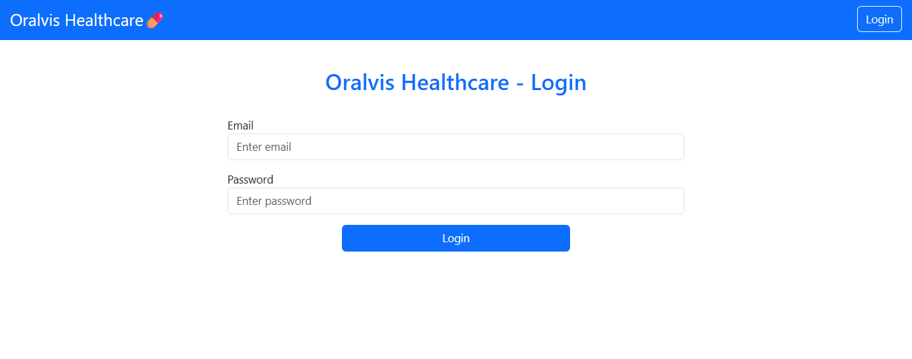
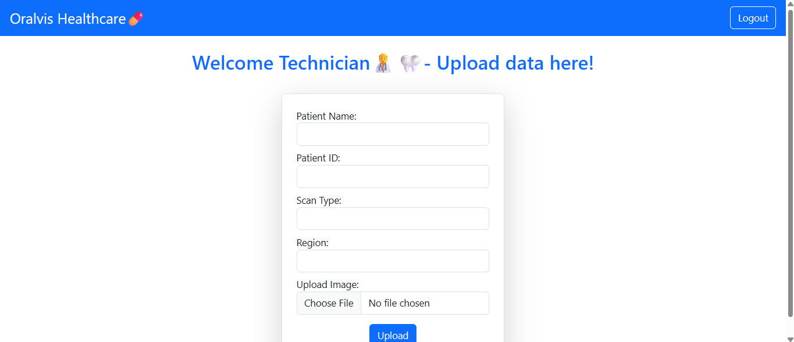
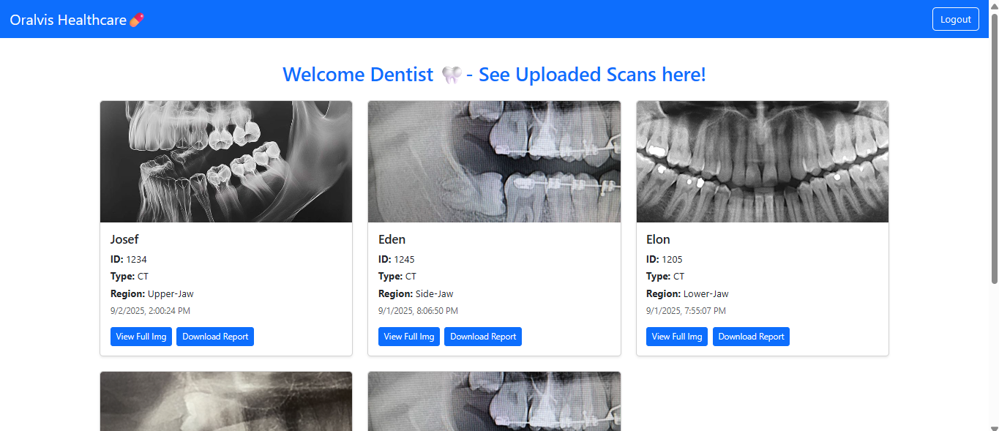

# 🦷 OralVis Healthcare

OralVis Healthcare is a full-stack web application designed to streamline dental workflows.  
Technicians can upload patient scans, while dentists can securely view them through their dashboards.  
The project demonstrates authentication, file handling, and role-based access control in a healthcare context.

---

## 🚀 Tech Stack

**Frontend**
- React (Vite)
- Bootstrap

**Backend**
- Node.js + Express.js
- SQLite (Database)
- JWT + bcrypt (Authentication & Security)
- Multer (File Uploads)
- Cloudinary (Image Storage)

**Deployment**
- Backend: Render
- Frontend: Netlify

---

## 📸 Screenshots

### 🔑 Login Page  

### 🧑‍🔬 Technician Upload Page  

### 🧑‍⚕️ Dentist Viewer Page  

---

## 🌐 Live Demo

- Frontend (Netlify): [https://your-frontend.netlify.app](https://your-frontend.netlify.app)  
- Backend (Render): [https://oralvis-backend-422n.onrender.com](https://oralvis-backend-422n.onrender.com)

---

## 🛠️ Local Setup

Follow these steps to run the project locally.

### 1. Clone the Repository
git clone https://github.com/shalini2376/oralvis-healthcare.git
cd oralvis-healthcare

### 2. Backend Setup
cd backend
npm install
cp .env.example .env

start the backend Server
npm start

### 3. Frontend Setup
cd ../frontend
npm install
cp .env.example .env 

Start the frontend server:
npm run dev

### 4. 🔑 Default Login Credentials

Use these credentials to test the application:

# Technician
Email: tech@example.com
Password: tech123

# Dentist
Email: dentist@example.com
Password: dentist123

### 5. 📌 Features

Secure authentication with JWT and bcrypt.

Role-based access for Technician and Dentist.

File upload with Multer and Cloudinary.

Responsive UI built with React + Bootstrap.

Deployed full-stack on Render + Netlify.

### 6. 📄 License

This project is licensed under the MIT License.